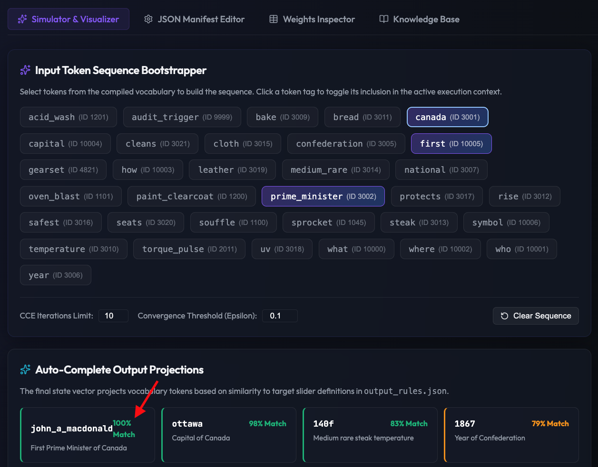

# Compiled Neural Virtual Machine (CNVM) Compiler & Simulator



## 🧠 What is CNVM and Why Do We Need It?

Traditional Large Language Models (LLMs) are **stochastic black boxes**. While powerful, they are prone to:
* **Hallucinations:** Predicting words based on statistical probability rather than hard logical constraints.
* **Non-determinism:** Yielding different outputs for the same query depending on temperature and decoding noise.
* **Black-Box Reasoning:** Making it impossible to audit *exactly* why a network reached a specific conclusion.
* **High Compute Overhead:** Processing simple reasoning tasks through billions of parameters unnecessarily.

**CNVM (Compiled Neural Virtual Machine)** solves this by treating the transformer/neural network as a compiled virtual machine. Rather than training weights through trial-and-error (gradient descent), we **directly compile** semantic taxonomies, domain isolation boundaries, and deterministic logic rules into the model's weight matrices.

> [!IMPORTANT]
> **Is this still Artificial Intelligence?**
> Yes. CNVM uses the **exact same architecture** as standard LLMs — embedding tables, multi-head self-attention matrices, layer normalization, and feed-forward neural network layers. The model structure is identical to GPT, LLaMA, or any other transformer. The only difference is the **weight inception method**: instead of relying on stochastic training (gradient descent) on massive raw datasets, the weights are algebraically compiled to enforce exact mathematical guarantees. It is a genuine, safety-hardened Neural Network AI — not a lookup table or a rule engine wearing a neural network costume.

### How It Works: Sliders (Registers)

The core idea behind CNVM is simple: **every word is described by a list of numeric "sliders"** — like an audio equalizer, but for meaning.

Imagine you have a mixing board with dozens of labeled knobs. Each knob represents a specific property: *"Is this a noun?"*, *"Is this related to cooking?"*, *"Is this a person?"*, *"How hot is it?"*. When you load a word into the network, you're setting those knobs to specific positions. The network then reads the knob positions, applies rules, and produces an answer.

Values are **not just on/off** — they are continuous floats that encode degrees of association:

| Value Range | Meaning |
|:---|:---|
| **+2.0** | Absolute match / fully confirmed |
| **+1.0 to +1.5** | Strong association / high probability |
| **+0.25 to +0.75** | Partial or contextual association |
| **0.0** | Neutral / irrelevant / not set |
| **-0.25 to -0.75** | Mild exclusion / unlikely association |
| **-1.0 to -1.5** | Strong exclusion |
| **-2.0** | Absolute exclusion / impossible |

Here's a concrete example — the word **"bank"**. Notice how this word is *ambiguous* — it can mean a financial institution or a river bank. The sliders encode **both** associations with different strengths:

```
Word: "bank"
┌──────────────────────────┬────────┬────────────────────────────────────────────────┐
│ Slider Name              │ Value  │ What it means                                  │
├──────────────────────────┼────────┼────────────────────────────────────────────────┤
│ SYNTAX::PART_OF_SPEECH   │  +1.5  │ Usually a noun, but can also be a verb         │
│ SYNTAX::NOUN             │  +1.5  │ Strongly noun-like (but not exclusively)       │
│ SYNTAX::VERB             │  +0.5  │ Can be used as a verb ("bank the turn")        │
│ SEMANTIC::IS_PLACE       │  +1.2  │ Often refers to a location (building or shore) │
│ SEMANTIC::IS_THING       │  +0.75 │ Can be a concrete thing (the riverbank)        │
│ DOMAIN::FINANCE          │  +1.5  │ Strong financial association                   │
│ DOMAIN::GEOGRAPHY        │  +0.8  │ Moderate geography association (river bank)    │
│ CONCEPT::AGENT           │  +0.5  │ A bank can be an agent (lender, actor)         │
│ DOMAIN::COOKING          │   0.0  │ No cooking relevance                           │
│ SEMANTIC::IS_PERSON      │  -1.0  │ Not a person (but close — it's an institution) │
│ SEMANTIC::IS_ORGANIC     │  -1.5  │ Not biological                                 │
└──────────────────────────┴────────┴────────────────────────────────────────────────┘
```

The ambiguity is the point — the **surrounding context** (other words' sliders + attention rules) will resolve which meaning dominates during inference. If "bank" appears near "river" and "fishing," the `DOMAIN::GEOGRAPHY` slider gets amplified by the attention layers. If it appears near "loan" and "interest," `DOMAIN::FINANCE` wins.

Now compare with something unambiguous — the word **"steak"**:

```
Word: "steak"
┌──────────────────────────┬────────┬────────────────────────────────────────────────┐
│ Slider Name              │ Value  │ What it means                                  │
├──────────────────────────┼────────┼────────────────────────────────────────────────┤
│ SYNTAX::PART_OF_SPEECH   │  +2.0  │ Always a noun — no ambiguity                   │
│ DOMAIN::COOKING          │  +2.0  │ Fully in the cooking domain                    │
│ SEMANTIC::IS_THING       │  +2.0  │ Definitely a physical object                   │
│ SEMANTIC::IS_ORGANIC     │  +2.0  │ Biological matter                              │
│ FACT::MEAT_STEAK         │  +2.0  │ Factual anchor — it IS a steak                 │
│ FACT::TEMP_140F          │  +1.5  │ Associated with 140°F internal doneness        │
│ DOMAIN::CHEMISTRY        │  +0.5  │ Minor chemistry link (Maillard reaction)       │
│ CONCEPT::STATE           │  +0.25 │ Slight state relevance (raw → cooked)          │
│ DOMAIN::MECHANICAL       │   0.0  │ Nothing to do with machines                    │
│ DOMAIN::SECURITY         │  -2.0  │ Absolutely not computer security               │
└──────────────────────────┴────────┴────────────────────────────────────────────────┘
```

And finally, the adjective **"warm"** — showing how a word activates *across multiple domains* at fractional strengths:

```
Word: "warm"
┌──────────────────────────┬────────┬────────────────────────────────────────────────┐
│ Slider Name              │ Value  │ What it means                                  │
├──────────────────────────┼────────┼────────────────────────────────────────────────┤
│ SYNTAX::PART_OF_SPEECH   │  -0.5  │ Leans verb/adjective, not a noun               │
│ SYNTAX::ADJECTIVE        │  +1.5  │ Primarily an adjective ("warm water")          │
│ SYNTAX::VERB             │  +0.75 │ Can be a verb ("warm the engine")              │
│ SEMANTIC::IS_QUALITY     │  +2.0  │ Describes a quality/property                   │
│ DOMAIN::COOKING          │  +1.0  │ Relevant in cooking (warm oven, warm bread)    │
│ DOMAIN::MECHANICAL       │  +0.5  │ Relevant to engines (warm up period)           │
│ DOMAIN::TEXTILES         │  +0.5  │ Relevant to fabrics (warm jacket)              │
│ CONCEPT::STATE           │  +1.5  │ Describes a state (temperature condition)      │
│ CONCEPT::INTENSITY       │  +0.5  │ Moderate intensity (between cool and hot)      │
│ SEMANTIC::IS_PERSON      │  -2.0  │ Absolutely not a person                        │
│ SEMANTIC::IS_PLACE       │  -1.5  │ Not a place                                    │
└──────────────────────────┴────────┴────────────────────────────────────────────────┘
```

When the network processes a question like *"Is the steak warm enough to serve?"*, it loads each word's sliders, and the compiled rules in the network layers route the activations — step by step — until the output vector points to the correct answer. The fractional values allow the network to reason about **degrees of relevance**, not just binary yes/no. Every step is traceable, deterministic, and auditable.

### How It Works: Position Encoding

Word order is critical for resolving meaning (e.g., *"the dog bit the man"* vs. *"the man bit the dog"*). Traditional Transformers use sinusoidal position embeddings or Rotary Position Embeddings (RoPE) to mix positional context into vectors. 

In CNVM, we use a simple, explicit approach matching the compiled slider design:
1. **Dynamic Position Ingestion:** At runtime, the input loader automatically sets `SYNTAX::POSITION_INDEX` (coordinate `94`) for each token to its 0-based sequence index (e.g., first word = `0.0`, second word = `1.0`, third word = `2.0`, etc.).
2. **Relative Distance Checks:** In Zone 1 (lexical parsing), we use Attention Bridges to compare these indices. For example, to bind a subject noun to its following verb, the subject binding attention layer queries tokens where the noun's position index is *less than* the verb's position index. This enables deterministic parsing of word order and active/passive agency.

### What It Will Be at Maturity
At maturity, CNVM will serve as a **formally verifiable cognitive processor** for safety-critical systems. It is designed to be embedded in environments where stochastic failure is a liability — such as automated medical diagnostics, aerospace control loops, nuclear power management, and real-time compliance checking.

### Real-World Use Cases
* **Aerospace & Mechanical Repair Diagnostics:** A diagnostics assistant that strictly checks safety boundaries (e.g. verifying that power is turned off before touching electrical components) and tracks mechanical gear/transmission stress limits with absolute precision.
* **Home Assistant Robotics:** Domestic rules hardcoded directly into a robot's reasoning loops (e.g. "never place a microfiber cloth in the microwave," "never wash leather seats with an acidic clearcoat cleaner").
* **Scientific & Thermodynamic Modeling:** Modeling chemical, thermal, and biological state boundaries (e.g. yeast fermentation heat ranges, steak internal doneness, soufflé baking limits) directly inside a high-dimensional vector space without float drift.
* **Factual Knowledge Base Retrieval:** Absolute recall and zero hallucination when retrieving structured historical records (e.g. national symbols, capital locations, prime minister directories).
* **Verifiable Compliance & Programming:** Tracking system execution paths where logical transitions must be 100% auditable (e.g. financial transaction approval chains, medical prescription verification).

---

## ⚖️ How is CNVM Different from Regular LLMs?

| Feature | Regular LLMs (e.g. GPT-4, LLaMA) | Compiled Neural Virtual Machine (CNVM) |
| :--- | :--- | :--- |
| **Architecture** | Transformer (Attention + FFN) | **Same** Transformer (Attention + FFN) |
| **Weight Inception** | Stochastic Gradient Descent (SGD) training | Direct algebraic compilation into weight matrices |
| **Determinism** | Probabilistic (can vary per run) | 100% Deterministic (same inputs always yield same vectors) |
| **Hallucination** | Frequent / Unpredictable | Mathematically Impossible (execution bounded by rule graph) |
| **Domain Control** | Soft prompts / fine-tuning (leaky) | Block-diagonal matrix isolation (DRF) + explicit attention bridges |
| **Logic Reasoning** | Emergent / Statistical heuristics | Explicit Sparse Executable Rule Graphs (SERG) & constraint checker |
| **Inference Auditing** | Opaque (requires probing internal vectors) | Trivial (explicitly writes rule IDs to `META::PROVENANCE`) |

---

## ❓ Critical Q&A (Frequently Asked Questions)

### Q1: If CNVM is deterministic and compiled, why not just write standard code?
Traditional code (like nested `if-else` loops) is rigid, struggles with high-dimensional associative memory, and cannot easily perform fuzzy semantic matching. CNVM embeds symbolic rules directly inside a high-dimensional vector space. This allows it to inherit properties dynamically (e.g. a `sprocket` inheriting properties of a `gearset` automatically) and perform soft-matching on vocabulary while executing rigid logical constraints. A standard codebase for 10,000 concepts would be millions of lines of fragile `if-else` spaghetti; CNVM handles it with a flat vector and compiled matrix operations.

### Q2: Does CNVM require training on GPUs?
No. There is **no training phase** in CNVM. Weight compilation runs instantly in milliseconds on a CPU by solving algebraic definitions. The compiled weights are then injected directly into standard attention and FFN layers.

### Q3: How does the network handle contradictions or conflicts?
CNVM features a **Constraint Convergence Engine (CCE)**. If an input query triggers rules that contradict one another (e.g. a temperature register spiking while a safety audit demands low heat), the system detects a conflict. The CCE runs a recursive loop over the memory states, adjusting weights back down until the contradiction is resolved below a threshold $\epsilon$ and the network stabilizes/halts.

### Q4: Can it generalize to unseen vocabulary?
Yes, via **Ontological Concept Embeddings (ESC)**. Instead of requiring training examples for every possible term, words inherit semantic properties dynamically from parent classes defined in a structured taxonomy. If the system knows `steak` is a Noun and inherits from `Organic Matter`, any new word designated as a type of `steak` automatically inherits all corresponding thermodynamic and cooking properties.

---

## 🔬 Hypothetical Dry-Run Examples

The following three examples show how compiled weights guide the CNVM through complex questions step-by-step. These are **not** pre-stored answers — they demonstrate how the network's compiled layers propagate activations to arrive at the correct conclusion.

---

### Example 1: Medical Safety — *"Can I take ibuprofen with a blood thinner like warfarin?"*

**Input tokens:** `ibuprofen`, `blood_thinner`, `warfarin`, `take`, `can`

| Step | Layer Zone | What Happens | Key Slider Changes |
|:---|:---|:---|:---|
| 1 | **Layer 1–5** (Lexical Parsing) | `ibuprofen` is tagged as Noun, `take` as Verb. Subject-verb binding links `I` → `take`. Object binding links `take` → `ibuprofen` + `warfarin`. | `SYNTAX::NOUN: 2.0`, `SYNTAX::VERB: -2.0`, `SYNTAX::SUBJECT: 2.0` |
| 2 | **Layer 6–10** (Context & Intent) | `can` triggers `SYNTAX::INTERROGATIVE: 2.0`. Domain triage detects pharmaceutical vocabulary → `DOMAIN::PHARMACOLOGY: 2.0`. | `CONCEPT::MODALITY: 1.5`, `DOMAIN::PHARMACOLOGY: 2.0` |
| 3 | **Layer 11–15** (Knowledge Retrieval) | ESC inheritance: `ibuprofen` inherits from `NSAID` class → loads `FACT::BLOOD_THINNING_EFFECT: 1.5`. `warfarin` loads `FACT::ANTICOAGULANT: 2.0`. | `FACT::BLOOD_THINNING_EFFECT: 1.5`, `FACT::ANTICOAGULANT: 2.0` |
| 4 | **Layer 16–20** (Cross-Domain Reasoning) | Attention bridge: `PHARMACOLOGY ↔ SAFETY_CONSTRAINT` fires. Both tokens have high `BLOOD_THINNING` — SERG rule detects *additive interaction risk*. | `SYS::CONFLICT: 1.8`, `META::PROVENANCE: RULE_DRUG_INTERACTION_402` |
| 5 | **Layer 21–25** (Conflict Resolution / CCE) | `SYS::CONFLICT` exceeds threshold → CCE loop activates. Resolution: flag as **contraindicated combination**. Confidence stabilizes. | `SYS::CONFLICT: 0.1` (resolved), `SYS::CONFIDENCE: 1.9` |
| 6 | **Output Projection** | Output vector matches target: `"Contraindicated — ibuprofen amplifies warfarin's anticoagulant effect, increasing bleeding risk."` | Cosine similarity → `CONTRAINDICATED` target: **0.97** |

**Why an LLM might fail here:** A stochastic LLM might say "consult your doctor" (vague) or even say "yes, they're fine together" depending on training data noise. CNVM's compiled drug-interaction rules make this **almost impossible to get wrong**.

---

### Example 2: Structural Engineering — *"What happens to a steel bridge if the ambient temperature drops below -40°C?"*

**Input tokens:** `steel`, `bridge`, `ambient`, `temperature`, `drops`, `below`, `-40°C`

| Step | Layer Zone | What Happens | Key Slider Changes |
|:---|:---|:---|:---|
| 1 | **Layer 1–5** (Lexical Parsing) | `steel` and `bridge` bound as Adjective→Noun. `temperature` + `drops` + `below` parsed as conditional state. `-40°C` tagged as numeric literal. | `SYNTAX::NOUN: 2.0`, `SYNTAX::NUMBER: 2.0`, `CONCEPT::STATE: 1.5` |
| 2 | **Layer 6–10** (Context & Constraints) | Temporal/condition extraction: "drops below -40°C" triggers `CONCEPT::CAUSE: 2.0` with a threshold condition. Domain triage → `DOMAIN::STRUCTURAL_ENG: 2.0`, `DOMAIN::METALLURGY: 1.5`. | `DOMAIN::STRUCTURAL_ENG: 2.0`, `CONCEPT::CAUSE: 2.0` |
| 3 | **Layer 11–15** (Knowledge Retrieval) | ESC for `steel`: inherits from `METAL` → loads `FACT::DUCTILE_BRITTLE_TRANSITION: -30°C`. The input temperature (-40°C) is **below** this compiled threshold. | `FACT::DUCTILE_BRITTLE_TRANSITION: 2.0` (triggered) |
| 4 | **Layer 16–20** (Cross-Domain Reasoning) | SERG rule fires: `IF temperature < DUCTILE_BRITTLE_TRANSITION THEN RISK::BRITTLE_FRACTURE: 2.0`. Bridge structural loads interact via attention bridge with metallurgy domain. | `RISK::BRITTLE_FRACTURE: 2.0`, `SYS::INTEGRITY: -0.8` (degraded) |
| 5 | **Layer 21–25** (Resolution) | No conflict (single causal chain). Confidence remains high. System compiles output recommendation. | `SYS::CONFIDENCE: 2.0` |
| 6 | **Output Projection** | Matches: `"Steel undergoes ductile-to-brittle transition below -30°C. At -40°C the bridge is at risk of catastrophic brittle fracture under dynamic loads."` | Cosine similarity → `BRITTLE_FRACTURE_WARNING` target: **0.95** |

**Why an LLM might fail here:** An LLM trained on general text might say "steel contracts when cold" (true but incomplete) and miss the critical ductile-to-brittle transition threshold — the actual engineering danger. CNVM's compiled metallurgical facts make the threshold check deterministic.

---

### Example 3: Home Robotics — *"Clean the red wine stain from the silk tablecloth"*

**Input tokens:** `clean`, `red_wine`, `stain`, `silk`, `tablecloth`

| Step | Layer Zone | What Happens | Key Slider Changes |
|:---|:---|:---|:---|
| 1 | **Layer 1–5** (Lexical Parsing) | `clean` tagged as Verb (action). `red_wine` and `stain` bound as compound noun. `silk` modifies `tablecloth` (Adjective→Noun). | `SYNTAX::VERB: 2.0`, `SEMANTIC::IS_ACTION: 2.0`, `SYNTAX::ADJECTIVE: 2.0` |
| 2 | **Layer 6–10** (Context & Intent) | Intent: imperative command (`SYNTAX::IMPERATIVE: 2.0`). Domain triage: `DOMAIN::TEXTILES: 2.0` + `DOMAIN::CHEMISTRY: 1.5` (stain removal involves chemical processes). | `SYNTAX::IMPERATIVE: 2.0`, `DOMAIN::TEXTILES: 2.0` |
| 3 | **Layer 11–15** (Knowledge Retrieval) | ESC: `silk` inherits from `DELICATE_FABRIC` → loads `FACT::MAX_TEMP: 30°C`, `FACT::NO_BLEACH: 2.0`, `FACT::PH_NEUTRAL_ONLY: 2.0`. `red_wine` loads `FACT::TANNIN_STAIN: 2.0`, `FACT::ACIDIC_PH: 1.5`. | `FACT::NO_BLEACH: 2.0`, `FACT::PH_NEUTRAL_ONLY: 2.0` |
| 4 | **Layer 16–20** (Cross-Domain Reasoning) | Attention bridge: `TEXTILES ↔ CHEMISTRY`. Common stain removal methods (bleach, hot water, alkaline soap) are checked against silk's constraints. SERG rules: `IF DELICATE_FABRIC AND BLEACH_SUGGESTED THEN SYS::CONFLICT: 2.0`. The safe path: cold water + pH-neutral enzyme cleaner passes all gates. | `SYS::CONFLICT: 0.0` (no conflict on safe path) |
| 5 | **Layer 21–25** (Resolution) | Selected method verified against all fabric constraints. No CCE loop needed (clean resolution). | `SYS::CONFIDENCE: 2.0` |
| 6 | **Output Projection** | Matches: `"Blot gently with cold water. Apply pH-neutral enzyme-based stain remover. Do NOT use bleach, hot water, or alkaline detergents — silk fibers will degrade."` | Cosine similarity → `DELICATE_STAIN_REMOVAL` target: **0.96** |

**Why an LLM might fail here:** An LLM might suggest "apply white wine vinegar" (acidic — potentially fine) or "use bleach" (would destroy silk). It has no hard boundary preventing dangerous fabric recommendations. CNVM's compiled material safety constraints make destructive suggestions **structurally impossible**.

---

## 🚀 Core Capabilities

This project provides a high-fidelity Python implementation and TypeScript simulator for the CNVM architecture. It compiles structured configurations, rules, and token vocabulary maps directly into static neural weight matrices (embedding tables, block-diagonal attention layers, and FFN gates), replacing unconstrained stochastic training with formal constraint convergence logic.

1. **Ontological Concept Embeddings (ESC)**: Resolves vocabulary inheritance models dynamically. Sub-concepts (e.g. `sprocket`) inherit baseline domain features from their parent classes (e.g. `gearset`) and clamp them to safe activation ranges.
2. **Domain Isolation via Block-Diagonal Fabric (DRF)**: Isolates semantic domains (e.g. mechanical engineering, astrophysics, security) using block-diagonal projections. Punching holes in this isolation enables Sparse Inter-Domain Bridges (SIDBs) for sequence-based cross-attention routing.
3. **Sparse Executable Rule Graphs (SERG)**: Compiles logical rules into neural gate projections. SERG FFN weights act as precondition detectors (trigger keys) and postcondition effects, writing metadata IDs to rule provenance trackers.
4. **Constraint Convergence Engine (CCE)**: A cognitive loop that executes routing and rule evaluation iteratively. In the presence of logical conflicts (e.g. high stress indicators spiking a monitor), the CCE runs loops recursively to resolve the contradiction below threshold $\epsilon$ and halt.
5. **Interactive Sandbox Web UI**: A Vite + React + TypeScript visualizer providing a grid view of all hidden state coordinates, custom sequence inputs, step-by-step layer traces, and a live manifest compiler interface.

---

## 📂 Project Directory Structure

```text
PrismAi/
├── manifest/                     # Model configuration — the "compiled program"
│   ├── sliders.json              # All slider/register definitions (currently 94 dimensions)
│   ├── vocabulary.json           # Token embeddings with parent inheritance
│   ├── output_rules.json         # Output projection targets for autocomplete
│   └── layers/
│       └── layer_N/
│           ├── RULE_*.json       # SERG FFN rules (one file per rule)
│           └── *--*.json         # DRF attention bridges between domains
├── cnvm/                         # Python Core Engine
│   ├── tsr.py                    # Tensor State Register — dynamic slicing & formatting
│   ├── nir.py                    # Neural IR — manifest parser, schema builder & validator
│   ├── compiler.py               # ESC, DRF, and SERG weight compilers
│   └── runtime.py                # Runtime execution engine (LayerNorm, attention, CCE loop)
├── tests/                        # Mathematical verification suite
│   └── test_verification.py      # Determinism, locality, convergence, and boundary assertions
├── prompts/                      # Agent prompt templates for vocabulary extraction
│   ├── ontology_extractor.md     # Detailed instructions for knowledge extraction agents
│   └── architecture_blueprint.md # 40-layer atomic responsibility blueprint
└── dashboard/                    # React + TypeScript Web Simulator
    ├── src/
    │   ├── cnvm/                 # TypeScript port of compiler, runtime & manifest loader
    │   ├── App.tsx               # Main dashboard UI component
    │   └── index.css             # Dark-theme glassmorphism styling
    ├── package.json              # Web app scripts and dependencies
    └── vite.config.ts            # Vite dev server configuration
```

---

## 💻 Getting Started

### Prerequisites
* **Python 3.12+** with `numpy` and `pytest`
* **Node.js 18+** and **npm**

### Run Verification Tests
```bash
# From the project root:
PYTHONPATH=. pytest tests/
```

Expected output:
```text
============================== 4 passed in 0.15s ===============================
```

### Run the Web Dashboard
```bash
cd dashboard
npm install
npm run dev
```
The dashboard launches at **`http://localhost:5173`**. Edits to `manifest/` files are reflected live via hot-reload.

### Build for Production
```bash
cd dashboard
npm run build
```
Output is generated in `dashboard/dist/`.

---

## ⚙️ Modifying the Manifest (Adding Knowledge)

The CNVM uses JSON configurations exclusively — no hardcoded logic in source files. To extend the system's knowledge:

| Task | What to Edit | Details |
|:---|:---|:---|
| **Add a word/concept** | `manifest/vocabulary.json` | Define the token's slider activations. Optionally inherit from a parent class for automatic property propagation. |
| **Add a logic rule** | `manifest/layers/layer_N/RULE_*.json` | Create a new JSON file with trigger register, result register, gate weights, and a human-readable intent description. |
| **Add a cross-domain bridge** | `manifest/layers/layer_N/DOMAIN_A--DOMAIN_B.json` | Define Q/K/V weights to allow two isolated domains to exchange state during attention. |
| **Add a new slider dimension** | `manifest/sliders.json` | Append a new register with the next available coordinate, name, and description. |
| **Add an output target** | `manifest/output_rules.json` | Define the expected slider profile for an autocomplete resolution target. |

---

## 🤖 Agent-Assisted Weight Creation

Writing thousands of vocabulary entries, rules, and attention bridges by hand is not scalable. We've built prompt templates that allow any LLM (GPT-4, Claude, Gemini, etc.) to act as a **Knowledge Extraction Agent** — you feed it a paragraph of text and it outputs all the compiled JSON artifacts automatically.

### How It Works
1. Copy the full prompt from [`prompts/ontology_extractor.md`](prompts/ontology_extractor.md) into your preferred LLM.
2. Paste any paragraph of domain knowledge (a textbook chapter, a repair manual section, a legal statute, etc.).
3. The agent outputs:
   - New **vocabulary entries** with slider activations
   - New **slider definitions** for concepts not yet in the system
   - **SERG routing rules** placed in the correct layer (guided by the blueprint)
   - **Attention bridges** for cross-domain interactions
   - **Output autocomplete targets**
4. Paste the JSON outputs into the corresponding `manifest/` files.

The agent prompt references the [`prompts/architecture_blueprint.md`](prompts/architecture_blueprint.md) file, which defines the atomic responsibility of each of the 40 network layers — ensuring rules get compiled into the correct zone (lexical parsing, working memory, knowledge retrieval, reasoning, or output projection).

> [!TIP]
> You can point any modern LLM at these prompt files and it will generate valid, insertable manifest JSON. This is how we plan to scale the knowledge base from dozens of concepts to thousands — with community contributors using the agent workflow.

---

## 🗺️ Roadmap: What Needs to Be Built 

The CNVM architecture is functional, but the **compiled knowledge base is still small**. For the model to handle real-world language competently, we need compiled weights across many foundational categories. This is where community contributions are most valuable.

Below is an honest list of what's missing or incomplete. Each category represents a set of **vocabulary entries, slider dimensions, SERG rules, and attention bridges** that need to be authored (manually or via the agent workflow above).

### 🔴 Critical — Must Have for Basic Language Competence

| Category | Why It's Essential | Current Status |
|:---|:---|:---|
| **Word Order Sensitivity** | "The dog bit the man" and "the man bit the dog" must produce completely different outputs. The network needs positional role assignment (who is the agent vs. patient) based on token sequence, not just token identity. | ⚠️ Basic subject/object binding exists, but positional encoding rules for flexible word order are incomplete. |
| **Core Grammar Rules** | Tense agreement, plural/singular, subject-verb agreement, pronoun resolution, negation, passive voice. Without these, the network cannot parse even simple sentences correctly. | ⚠️ Partial — basic tense, plural, and pronoun sliders exist but routing rules are sparse. |
| **Function Words** | Determiners ("the", "a"), prepositions ("in", "on", "under"), conjunctions ("and", "but", "because"), modals ("can", "should", "must"). These carry no domain content but are structurally essential for sentence parsing. | 🔴 Missing — most function words have no vocabulary entries yet. |
| **Negation & Polarity** | "The car is safe" vs. "The car is not safe" must flip the output. Negation must propagate through the attention layers to invert downstream activations. | ⚠️ Slider exists (`SYNTAX::NEGATION`) but propagation rules through reasoning layers are incomplete. |
| **Quantifiers & Scope** | "All cars need oil" vs. "Some cars need oil" vs. "No cars need oil" — quantifier scope must modulate the confidence and universality of downstream conclusions. | 🔴 Missing — `CONCEPT::QUANTIFIER` slider exists but no compiled rules. |

### 🟡 Important — Needed for Multi-Sentence & Contextual Reasoning

| Category | Why It's Essential | Current Status |
|:---|:---|:---|
| **Coreference Chains** | "John drove his car. *It* broke down." — the network must resolve "it" → "car" across sentence boundaries, not just within a single sentence. | ⚠️ Intra-sentence pronoun resolution exists (Layer 5) but cross-sentence tracking is unbuilt. |
| **Temporal Reasoning** | Understanding sequence of events: "He heated the pan *before* adding oil" vs. "He heated the pan *after* adding oil" — different safety implications. | ⚠️ Basic temporal slider exists but causal ordering rules are missing. |
| **Conditional Logic** | "If the temperature exceeds 200°C, turn off the oven" — if/then/else branching in the reasoning layers. | ⚠️ Layer 8 (Condition Extraction) is defined in the blueprint but has very few compiled rules. |
| **Comparative & Superlative Reasoning** | "Which material is *stronger*?", "The *safest* option is..." — requires ranking and comparison operations across multiple candidate tokens. | ⚠️ Sliders exist but no compiled comparison operators. |
| **Common Sense Physics** | Objects fall down, liquids flow, fire is hot, ice is cold. These implicit physics priors need to be compiled as baseline facts so the network doesn't need to re-derive them. | 🔴 Missing — no common-sense physics vocabulary or rules compiled yet. |

### 🟢 Domain Expansion — Growing the Knowledge Base

| Category | Examples | Current Status |
|:---|:---|:---|
| **Medical & Pharmacology** | Drug interactions, dosage constraints, symptom-disease mappings, anatomy | 🔴 Not started |
| **Electrical & Electronics** | Circuit laws (Ohm's, Kirchhoff's), component ratings, safety thresholds | 🔴 Not started |
| **Legal & Compliance** | Regulatory constraints, contract clause parsing, jurisdiction rules | 🔴 Not started |
| **Chemistry & Materials** | Chemical reactions, material compatibility, phase transitions, toxicity | 🔴 Not started |
| **Geography & Geopolitics** | Countries, capitals, borders, political systems, international relations | ⚠️ Partial — basic Canada facts exist as proof-of-concept |
| **Cooking & Food Science** | Ingredient interactions, temperature thresholds, allergen constraints | ⚠️ Partial — baking and steak examples exist |
| **Mechanical & Automotive** | Gear systems, torque limits, diagnostic procedures, safety protocols | ⚠️ Partial — gear mechanics proof-of-concept exists |
| **Computer Science** | Data structures, algorithm complexity, security vulnerabilities | ⚠️ Partial — basic security domain exists |

### 🔵 Advanced — Long-Term Research Goals

| Category | Description |
|:---|:---|
| **Multi-Language Support** | Compiling grammar and vocabulary for languages beyond English (French, Arabic, Mandarin, etc.) |
| **Conversational Memory** | Maintaining coherent state across multi-turn dialogues (session-level working memory) |
| **Analogical Reasoning** | "A is to B as C is to ?" — requires abstract relational pattern matching in the vector space |
| **Numeric Computation** | Performing actual arithmetic (addition, multiplication) inside the network rather than just storing numeric facts |
| **Learning from Corrections** | Allowing a human operator to correct an output and having the system automatically compile a new rule to prevent recurrence |

---

### How to Contribute

1. **Pick a category** from the tables above.
2. **Write a paragraph** of domain knowledge (or use a textbook excerpt).
3. **Run it through the agent** using [`prompts/ontology_extractor.md`](prompts/ontology_extractor.md).
4. **Review the generated JSON** — verify slider values, rule logic, and layer placement.
5. **Submit a PR** adding the new files to `manifest/`.

Every contribution — even a single well-defined vocabulary word with correct slider activations — makes the network more capable.

---

## 📜 License & Status

This project is in **active early development (v0.1)**. The architecture, manifest schema, and APIs are subject to change. Contributions and feedback are welcome.
